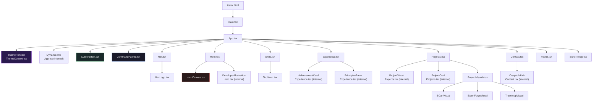
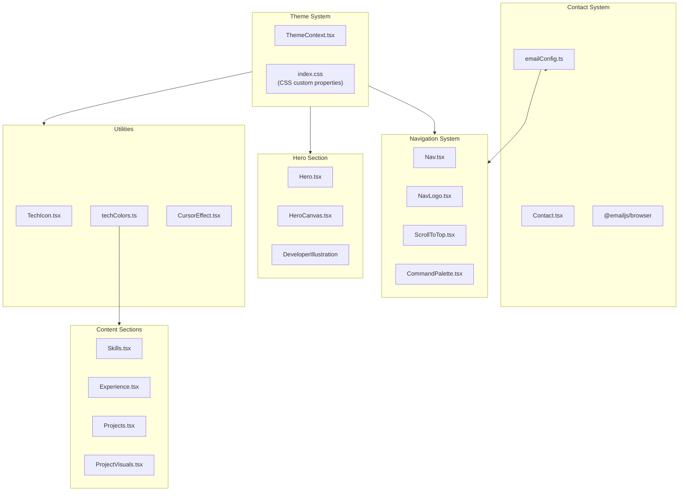
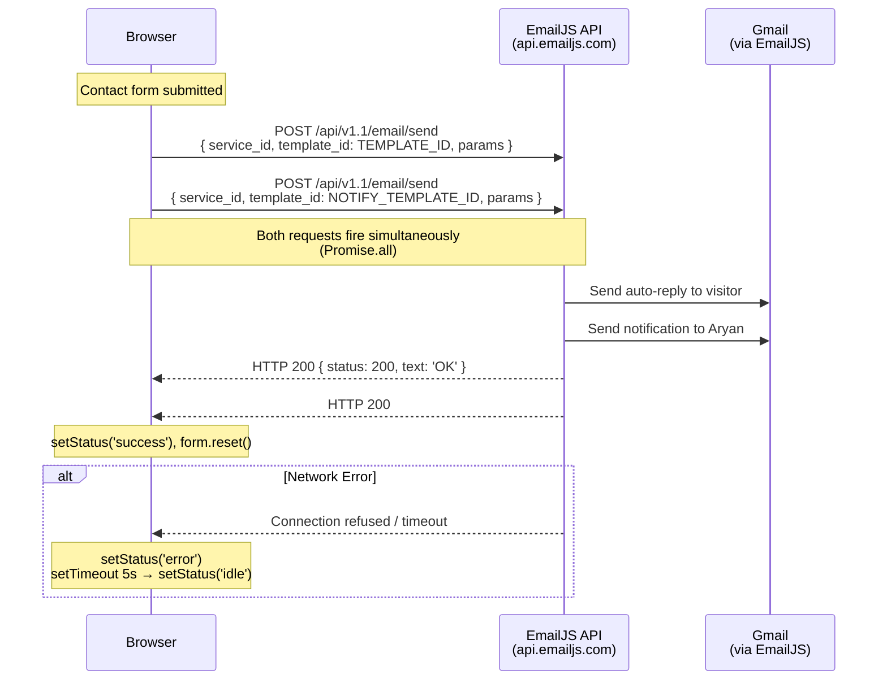
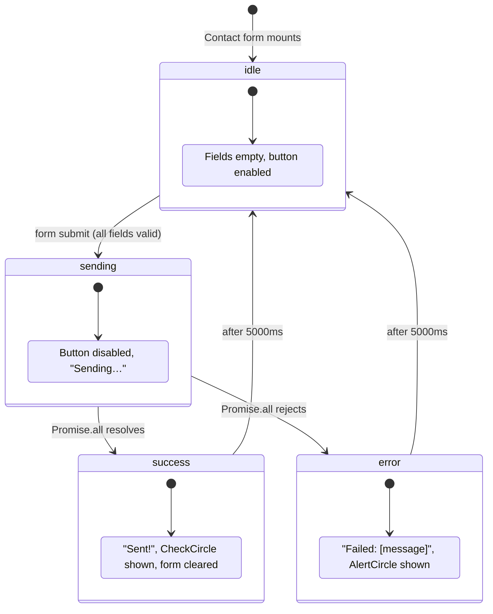
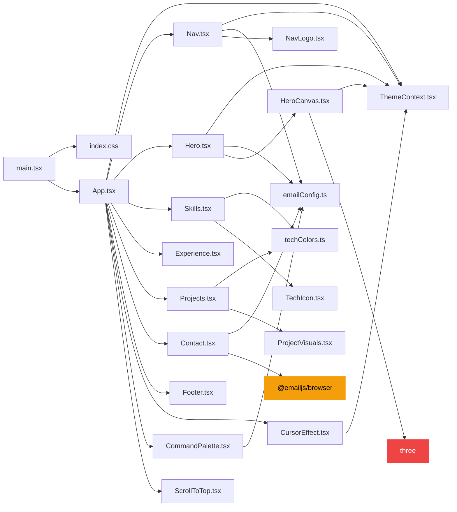
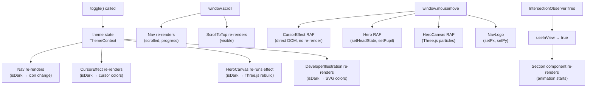

# Dependency Graphs

> Visual representations of how files, components, data, APIs, and state relate to each other in the `aryan-portfolio` codebase.

---

## Component Graph

Full component tree with all render relationships.



---

## Data Flow Graph

Where data originates and how it reaches the UI.

```mermaid
graph LR
    LS["localStorage\n(MANUAL_KEY, THEME_KEY)"] -->|read on init| TC["ThemeContext"]
    TIME["new Date().getHours()"] -->|getTimeBasedTheme()| TC

    TC -->|theme, isDark, toggle| NAV["Nav"]
    TC -->|isDark| HC["HeroCanvas"]
    TC -->|isDark| DI["DeveloperIllustration"]
    TC -->|isDark| CE["CursorEffect"]
    TC -->|isDark| NL["NavLogo"]

    NAV -->|toggle()| TC

    EC["emailConfig.ts\nEMAILJS, RESUME_URL"] -->|RESUME_URL| NAV
    EC -->|RESUME_URL| HERO["Hero"]
    EC -->|RESUME_URL| CP["CommandPalette"]
    EC -->|EMAILJS.*| CONT["Contact"]

    TC_D["TECH_COLORS\ntechColors.ts"] -->|getTechColor()| SKILLS["Skills"]
    TC_D -->|getTechColor()| PROJ["Projects"]

    PROJ_D["PROJECTS array\nProjects.tsx"] -->|props| PC["ProjectCard"]
    PC -->|project.stack| TC_D
    PC -->|project.title| VM["VISUAL_MAP"]
    VM -->|JSX| PVS["ProjectVisuals"]

    CMD["COMMANDS array\nCommandPalette.tsx"] -->|filtered| CPR["Palette results"]

    EMAILJS["EmailJS API\napi.emailjs.com"] -->|success/error| CONT
    CONT -->|setStatus| SUI["Status UI"]
```

---

## Feature Graph

Feature groupings and their file ownership.



---

## API Graph

All external API communications.



**External Resources (no API — just linked)**

| Resource | URL Pattern | Used By |
|---|---|---|
| Google Fonts | `fonts.googleapis.com/css2?...` | `index.html` (link tag) |
| GitHub | `github.com/aryanf192811-eng/*` | Hero, Contact, Footer links |
| LinkedIn | `linkedin.com/in/ganpati-kumar-686a88358/` | Hero, Contact, Footer links |
| Resume PDF | `/aryan_resume.pdf` (self-hosted) | Nav, Hero, CommandPalette |

---

## State Graph

All state variables and their transitions.



```mermaid
stateDiagram-v2
    [*] --> dark_or_light : ThemeProvider init

    state init_decision {
        [*] --> check_manual
        check_manual --> use_saved : manual=true AND saved valid
        check_manual --> use_time : no manual preference
    }

    use_saved --> dark_or_light
    use_time --> dark_or_light

    state dark_or_light {
        dark : Dark theme (hour < 6 or >= 18)
        light : Light theme (hour 6-17)
    }

    dark --> light : toggle() OR auto-sync at 06:00
    light --> dark : toggle() OR auto-sync at 18:00

    note right of dark : classList: 'dark' on html\nCSS: --bg: #0a0a0a
    note right of light : classList: 'light' on html\nCSS: --bg: #f7f7f7
```

---

## Import Graph

Which files import which — the module dependency tree.



---

## Reactive Update Graph

When X changes, which components re-render?



---

## CSS Token Graph

How the design system's CSS custom properties flow from `:root` to components.

```mermaid
graph TD
    ROOT[":root (dark) / html.light"] -->|--bg| BG["body background\n<section> backgrounds"]
    ROOT -->|--surface| SURF["Card backgrounds\nNav background (glass)\nCommandPalette bg"]
    ROOT -->|--surface-2| SURF2["Hover backgrounds\nCode blocks"]
    ROOT -->|--border| BORD["Card borders\nSection separators"]
    ROOT -->|--border-2| BORD2["Subtle borders\nCTA button borders"]
    ROOT -->|--text| TEXT["Primary text\nHeadings\nButton text (inverted)"]
    ROOT -->|--text-muted| MUTED["Body text\nNav links\nSubtitles"]
    ROOT -->|--text-faint| FAINT["Labels\nCaption text\nMono labels"]
    ROOT -->|--nav-bg| NAV_CSS["Nav glassmorphism\n(rgba + blur)"]
    ROOT -->|--input-bg & --input-border| INPUT["Contact form inputs"]
    ROOT -->|--tag-bg & --tag-text| TAGS[".tech-tag pills"]
    ROOT -->|--card-hover-bg & fg| HOVER["Skill card hover\n(inverts bg/text)"]
```



---

*All graphs derived from actual file import statements, state variables, and CSS declarations.*
