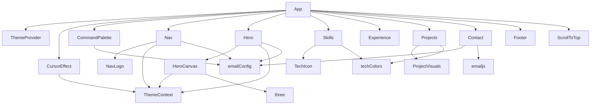

# Module 05 — Component System

## Purpose

Understand the architecture of the 14 components, the patterns they share, how they communicate, and why they're structured the way they are.

---

## Why It Exists

Components are React's unit of composition. This portfolio's component system is built around three principles:
1. **Self-contained sections** — each section component owns its data, its animations, and its layout
2. **Shared design language** — CSS custom properties ensure visual consistency without shared JavaScript state
3. **Minimal coupling** — components communicate only through `useTheme()` context; everything else is isolated

---

## Files Involved

| Component | Type | Depends On |
|---|---|---|
| `App.tsx` | Root compositor | All components |
| `Nav.tsx` | UI - Navigation | `ThemeContext`, `emailConfig`, `NavLogo` |
| `NavLogo.tsx` | UI - Interactive SVG | None |
| `Hero.tsx` | UI - Landing section | `ThemeContext`, `emailConfig`, `HeroCanvas` |
| `HeroCanvas.tsx` | UI - Three.js canvas | `ThemeContext`, `three` |
| `Skills.tsx` | UI - Skill display | `techColors`, `TechIcon` |
| `TechIcon.tsx` | UI - Icon factory | None |
| `Experience.tsx` | UI - Work history | None |
| `Projects.tsx` | UI - Project display | `techColors`, `ProjectVisuals` |
| `ProjectVisuals.tsx` | UI - Animated SVG art | `framer-motion` |
| `Contact.tsx` | UI + Integration | `emailConfig`, `emailjs` |
| `Footer.tsx` | UI - Footer | None |
| `CursorEffect.tsx` | Behavioral | `ThemeContext` |
| `CommandPalette.tsx` | Behavioral | `emailConfig` |
| `ScrollToTop.tsx` | Behavioral | None |

---

## Component Categories

### Section Components (render actual page sections)
`Hero`, `Skills`, `Experience`, `Projects`, `Contact`, `Footer` — these form the visible page content. Each is a `<section>` with an `id` attribute.

### Navigation Components
`Nav`, `NavLogo` — always visible, fixed at the top.

### Behavioral Components (render DOM overlays or nothing)
`CursorEffect` (renders two positioned `div`s), `CommandPalette` (renders a portal-style overlay), `ScrollToTop` (renders a floating button), `DynamicTitle` in `App.tsx` (renders `null`).

### Sub-components (not exported, used internally)
- `DeveloperIllustration` inside `Hero.tsx` — the SVG avatar
- `ProjectVisual` inside `Projects.tsx` — the 3D tilt card wrapper
- `ProjectCard` inside `Projects.tsx` — individual project layout
- `AchievementCard` inside `Experience.tsx`
- `PrinciplesPanel` inside `Experience.tsx`
- `CopyableLink` inside `Contact.tsx`

---

## Dependency Map



---

## Runtime Execution Flow

### Scroll-Triggered Animations (the `useInView` pattern)

Every section except Hero uses `useInView` from Framer Motion:

```tsx
// Skills.tsx (representative example)
export default function Skills() {
  const ref = useRef<HTMLDivElement>(null)
  const inView = useInView(ref, { once: true, margin: '-60px' })

  return (
    <section id="skills">
      <div className="section-wrap" ref={ref}>
        <motion.div
          initial={{ opacity: 0, y: 16 }}
          animate={inView ? { opacity: 1, y: 0 } : {}}
          transition={{ duration: 0.5 }}
        >
          {/* content */}
        </motion.div>
      </div>
    </section>
  )
}
```

**How `useInView` works:**
1. Attaches an `IntersectionObserver` to the `ref` element
2. Returns `true` when the element enters the viewport (with a `-60px` margin — fires 60px before the element reaches the viewport edge)
3. With `{ once: true }` — only fires once, then the observer disconnects

**The animation pattern:**
- `initial={{ opacity: 0, y: 16 }}` — starts invisible and 16px below
- `animate={inView ? { opacity: 1, y: 0 } : {}}` — only animates when in view
- When `inView` is `false`, `animate={}` means "do not animate" — the element stays at `initial`

### Staggered Children with `variants`

Skills uses Framer Motion's `variants` system for cascading entrance animations:

```tsx
// Skills.tsx
const containerV = { 
  hidden: {},
  visible: { transition: { staggerChildren: 0.055 } }  // 55ms delay between each child
}
const cardV = { 
  hidden: { opacity: 0, y: 20 }, 
  visible: { opacity: 1, y: 0, transition: { duration: 0.38 } }
}

<motion.div
  className="skills-core-grid"
  variants={containerV}
  initial="hidden"
  animate={inView ? 'visible' : 'hidden'}
>
  {CORE_SKILLS.map(skill => (
    <motion.div key={skill.name} variants={cardV}>
      {/* card content */}
    </motion.div>
  ))}
</motion.div>
```

The parent sets `variants.visible.transition.staggerChildren`. Each child inherits variants by name matching. When the parent switches from "hidden" to "visible", each child animates in sequence with 55ms gaps.

### The Tilt Card Pattern (Projects)

```tsx
// Projects.tsx — ProjectVisual component
function ProjectVisual({ project }: { project: Project }) {
  const cardRef = useRef<HTMLDivElement>(null)
  const [tilt, setTilt] = useState({ x: 0, y: 0 })

  const onMouseMove = (e: React.MouseEvent<HTMLDivElement>) => {
    const el = cardRef.current
    if (!el) return
    const r = el.getBoundingClientRect()
    // Normalize to -1 to +1 range centered on card
    const nx = ((e.clientX - r.left) / r.width - 0.5) * 2
    const ny = ((e.clientY - r.top) / r.height - 0.5) * 2
    setTilt({ x: ny * -10, y: nx * 10 })  // max ±10° tilt
  }

  return (
    <div
      ref={cardRef}
      onMouseMove={onMouseMove}
      onMouseLeave={() => setTilt({ x: 0, y: 0 })}  // reset on leave
      style={{
        transform: `perspective(900px) rotateX(${tilt.x}deg) rotateY(${tilt.y}deg)`,
        transition: 'transform 0.12s ease, box-shadow 0.2s',
        boxShadow: tilt.x !== 0 ? `0 20px 50px ${project.accent}22` : 'none',
      }}
    >
      {/* card content */}
    </div>
  )
}
```

This uses React state (`useState`) for the tilt because tilt affects rendered output. Contrast with `CursorEffect` which uses direct DOM manipulation — the cursor position doesn't need React to know about it.

---

## Data Flow

### How Section Data Flows (top-down)

```
PROJECTS constant (defined in Projects.tsx)
  └── Projects() renders
        └── PROJECTS.map(project => <ProjectCard project={project} index={i} />)
              └── ProjectCard receives project as prop
                    └── project.stack.map(t => getTechColor(t)) → colored badge
                    └── VISUAL_MAP[project.title] → correct SVG visual
                    └── project.links.map(link => <a href={link.href}>)
```

All project data lives in `PROJECTS`. No API calls. No state. The data is compile-time static — it only changes when the developer edits the file.

### How Theme Flows (through context)

```
ThemeProvider (in App.tsx)
  └── creates ThemeContext.Provider with { theme, isDark, toggle }
        └── every descendant can call useTheme()

Components that read theme:
  ├── Nav.tsx: isDark → Sun/Moon icon choice
  ├── HeroCanvas.tsx: isDark → particle colors
  ├── Hero.tsx → DeveloperIllustration: isDark → SVG fill colors
  └── CursorEffect.tsx: isDark → cursor color
```

The `toggle` function is used by two components: `Nav.tsx` (desktop theme button) and `Nav.tsx` (mobile theme button — same component, two instances of the button).

---

## Deep Code Walkthrough

### Component Size Ranges

| Component | Lines | Complexity |
|---|---|---|
| `Footer.tsx` | 46 | Low — static HTML |
| `ScrollToTop.tsx` | 43 | Low — one boolean state |
| `NavLogo.tsx` | 106 | Medium — timer + mouse tracking |
| `CursorEffect.tsx` | 94 | Medium — RAF loop |
| `Contact.tsx` | 283 | Medium — async form logic |
| `Skills.tsx` | 240 | Medium — multiple data structures |
| `Projects.tsx` | 279 | Medium — compound component pattern |
| `CommandPalette.tsx` | 368 | High — keyboard handler, fuzzy search, animation |
| `Hero.tsx` | 414 | High — SVG avatar physics, typewriter, Framer Motion |
| `Experience.tsx` | 438 | High — interactive selector, multiple sub-components |
| `HeroCanvas.tsx` | 112 | High — Three.js WebGL setup |
| `ProjectVisuals.tsx` | 331 | High — three complex animated SVGs |
| `TechIcon.tsx` | 139 | Low — lookup table of SVG paths |

### The Inline Sub-component Pattern

Instead of creating separate files, small sub-components are defined in the same file:

```tsx
// Experience.tsx — AchievementCard is NOT exported, used only in Experience
function AchievementCard({ a, delay, inView }: { a: typeof ACHIEVEMENTS[0]; delay: number; inView: boolean }) {
  const [hovered, setHovered] = useState(false)
  // ...
}

// PrinciplesPanel is also internal to Experience.tsx
function PrinciplesPanel({ inView }: { inView: boolean }) {
  // ...
}

export default function Experience() {
  // uses AchievementCard and PrinciplesPanel
}
```

This keeps the file readable (all logic in one place) without the overhead of a separate file. The convention: if a component is only used by one parent, define it in the same file.

### `AnimatePresence` — Exit Animations

```tsx
// ScrollToTop.tsx — button animates in AND out
<AnimatePresence>
  {visible && (
    <motion.button
      initial={{ opacity: 0, y: 16 }}
      animate={{ opacity: 1, y: 0 }}
      exit={{ opacity: 0, y: 16 }}   // ← exit only works inside AnimatePresence
    >
      ↑
    </motion.button>
  )}
</AnimatePresence>
```

Without `AnimatePresence`, the button would disappear instantly when `visible` becomes `false`. `AnimatePresence` detects when children are removed from JSX and runs their `exit` animation before actually removing them from the DOM.

---

## Senior Engineer Perspective

**Co-location over abstraction.** Static data (`PROJECTS`, `COMMANDS`, `GREETINGS`) lives in the component file, not in a separate `data/` folder. This means less file-hopping when you want to understand a component. The downside: if multiple components needed the same data, you'd have to extract it. Currently nothing is duplicated.

**No shared component library.** There are no shared `Button`, `Card`, `Input` components. Every component styles itself. This means more code but zero coupling — changing one component's styles can't break another's. For a single-developer portfolio, this is correct.

**Props vs. children.** Section components (`Hero`, `Skills`, etc.) accept no props — their data is hardcoded. Only sub-components (`ProjectCard`, `AchievementCard`) receive props from their parents. This is intentional: section components are singleton instances, not reusable.

---

## Common Bugs

| Bug | Root Cause | File |
|---|---|---|
| InView animation fires immediately on load | `margin` too large in `useInView` | The component using `useInView` |
| Stagger animation doesn't work | `variants` prop missing on a child | Check that `variants={cardV}` is on the `motion.div` |
| Tilt stays after mouse leaves | `onMouseLeave` not attached | `ProjectVisual` in `Projects.tsx` |
| Sub-component not updating | Component is defined inside parent function (bad) | Move sub-component outside parent function |
| Animation re-plays on tab switch | Using `once: false` in `useInView` | Change to `{ once: true }` |

---

## Hands-On Exercises

1. **Add a new achievement card:** In `Experience.tsx`, add a 4th item to the `ACHIEVEMENTS` array. See how the cards reflow automatically.
2. **Create a new sub-component:** Extract `CopyableLink` from `Contact.tsx` into its own file `src/components/CopyableLink.tsx`. Update the import in `Contact.tsx`. This teaches the file extraction pattern.
3. **Modify the stagger timing:** In `Skills.tsx`, change `staggerChildren: 0.055` to `0.15`. Reload. Can you see the difference? Change it to `0` — what happens?
4. **Inspect AnimatePresence:** In `ScrollToTop.tsx`, remove `<AnimatePresence>` wrapper and the `exit` prop. Scroll down so the button appears, then scroll up. What's different about how the button disappears?

---

## Knowledge Prerequisites

| Concept | Why You Need It |
|---|---|
| React props | How data flows from parent to child |
| React `useRef` + `useEffect` | Used in every component |
| Framer Motion `initial`/`animate`/`exit` | The animation model |
| `IntersectionObserver` (via `useInView`) | Scroll-triggered animations |
| CSS `transform: perspective()` | The 3D tilt effect |
